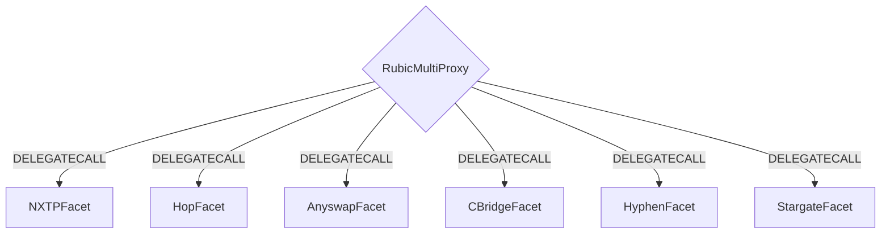
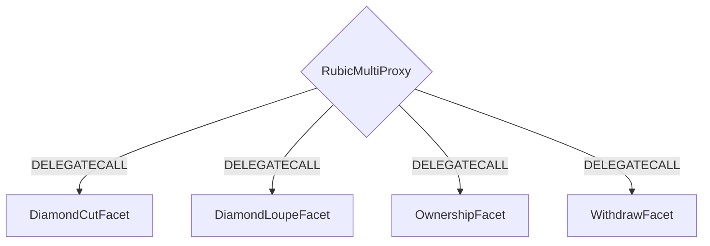

[](https://github.com/Cryptorubic/multi-proxy-rubic/actions/workflows/forge.yml)

# Rubic Smart Contracts

## Table of contents

1. [General](#general)
2. [Why Rubic?](#why)
   1. [Our Thesis](#thesis)
   2. [Ecosystem Problems](#ecosystem-problems)
   3. [Developer Problems](#developer-problems)
   4. [Solution](#solution)
3. [How It Works](#how-it-works)
4. [Architecture](#architecture)
   1. [Contract Flow](#contract-flow)
   2. [Diamond Helper Contracts](#diamond-helper-contracts)
5. [Repository Structure](#repository-structure)
6. [Getting Started](#getting-started)
   1. [INSTALL](#install)
   2. [TEST](#test)
   3. [TEST With Foundry/Forge](#foundry-forge)
7. [Contract Docs](#contract-docs)
8. [Configuration](#configuration)
   1. [Before deployment](#configuration_before)
   2. [After deployment](#configuration_after)
9. [DEPLOY](#deploy)

## General<a name="general"></a>

Our vision is to create a middle layer between DeFi infrastructure and the application layer.
Rubic aims to aggregate and abstract away the most important bridges and connect them to DEXs and DEX aggregators on each chain to facilitate cross-chain any-2-any swaps.

To decide which bridge to use, we assess and measure the degree of decentralization, trust assumptions, fees, gas efficiency, speed, and other qualitative and quantitative factors.
Then, we use the thresholds and preferences of our integration partners and end-users to select the right path.

## Why Rubic?<a name="why"></a>

### Our Thesis<a name="thesis"></a>

- The future is multi-chain
- Cross-chain bridging solutions will play a major role on infrastructure level
- Aggregation will pave the way for mass adoption

---

### Ecosystem Problems<a name="ecosystem-problems"></a>

**dApps**: Many users come across a new interesting dApp on a chain they don't have funds in and struggle to get their funds there. This is significant friction in user onboarding as they have to research and find bridges to that chain to start using the dApp.

**Yield Aggregators**: There are definitely protocols with better yield on new L2/side-chains but there isn't a secure, reliable way to transfer your funds.

**Wallets**: Multichain wallets want to compete with CEXes, but they don't have a way to allow easy swap between assets like CEXes.

**DeFi Protocols**: DeFi Dashboards, lending protocols, yield farms, etc., that are present on new chains create a need to do cross-chain swaps, but their users have to wander the ecosystem to quench this need.

---

### Developer Problems<a name="developer-problems"></a>

**Too many bridges** to educate yourself about.
It'd be good to have access to all of them and getting good guidance from people and algorithms that are specialized.

➔ Rubic does that.

**Bridges are still immature** so it's good to have not only one bridge but fallback solutions in place.
Immaturity comes with security risks, insufficient liquidity and a lot of maintenance overhead.

➔ Rubic maintains all bridge connections, gives you access to multiple ones and handles fallbacks and decision-making programmatically.

**Bridges are most often not enough**.
You also need DEXes/DEX aggregators as bridges are limited to stable-coins and native currencies.

➔ Rubic not only aggregates bridges, but also connects to sorts of DEX aggregators and if not available, the DEXs directly in order to find the best swap possible to arrive at the desired token and to allow to start the whole process with any asset.

---

### Solution<a name="solution"></a>

A data mesh of cross-chain liquidity sources: cross-chain liquidity networks, bridges, DEXes, bridges, and lending protocols.

As a bridge and DEX aggregator, Rubic can route any asset on any chain to the desired asset on the desired chain, thus providing a remarkable UX to their users.

All of this will be made available on an API/Contract level which comes as SDK, iFrame solution, and as a widget for other developers to plug directly into their products.
No need for users to leave your dApps anymore.

## How It Works<a name="how-it-works"></a>

Our [API](https://apidocs.li.fi/) and [SDK](https://docs.li.fi/products/integrate-li.fi-js-sdk/install-li.fi-sdk) allow dApps and dApp developers to request the best routes for a desired cross-chain swap.
Our backend will calculate the best possible routes based on the transaction fees, gas costs and execution duration.

The then returned routes contain already populated transactions which can directly be sent via the user's wallet to our contracts.
A single transaction can contain multiple steps (e.g. AAVE on Polygon -> DAI on Polygon using Paraswap -> DAI on Avalanche using NXTP -> SPELL on Avalanche using Paraswap) which will be executed by our contract.
Finally, the final amount of the requested token is sent to the user's wallet.

## Architecture<a name="architecture"></a>

The Rubic Contract is built using the EIP-2535 (Multi-facet Proxy) standard. The contract logic lives behind a single contract that in turn uses DELEGATECALL to call **facet** contracts that contain the business logic.

All business logic is built using **facet** contracts which live in `src/Facets`.

For more information on EIP-2535 you can view the entire EIP [here](https://eips.ethereum.org/EIPS/eip-2535).

---

### Contract Flow<a name="contract-flow"></a>

A basic example would be a user bridging from one chain to another using Hop Protocol. The user would interact with the RubicDiamond contract which would pass the Hop specific call to the HopFacet which then passes required calls + parameters to Hop Protocol's contracts.

The basic flow is illustrated below.



---

### Diamond Helper Contracts<a name="diamond-helper-contracts"></a>

The RubicMultiProxy contract is deployed along with some helper contracts that facilitate things like upgrading facet contracts, look-ups for methods on facet contracts, ownership checking and withdrawals of funds. For specific details please check out [EIP-2535](https://eips.ethereum.org/EIPS/eip-2535).



## Repository Structure<a name="repository-structure"></a>

```
contracts
│ README.md                   // you are here
│ ...                         // setup and development configuration files
│
├─── config                   // service configuration files
├─── constants                // general constants
├─── deploy                   // deployment scripts
├─── diamondABI               // Diamond ABI definition
├─── export                   // deployed results
├─── scripts                  // scripts containing sample calls for demonstration
│
├─── src                      // the contract code
│   ├── Facets                // service facets
│   ├── Interfaces            // interface definitions
│   └── Libraries             // library definitions
│
├───tasks
│   │ generateDiamondABI.ts   // script to generate Diamond ABI including all facets
│
├─── test                     // contract unit tests
│   ├─── facets               // facet tests
│   ├─── fixtures             // service fixtures for running the tests
│   └─── utils                // testing utility functions
│
└─── utils                    // utility scripts
```

## Contract Docs<a name="contract-docs"></a>

You can read more details documentation on each facet [here](./docs/README.md).
Sample requests to fetch transactions for each facet can be found at the end of each section.

## Getting Started<a name="getting-started"></a>

Make sure to copy `.env.example` to `.env` and fill out the missing values.

### INSTALL<a name="install"></a>

```bash
yarn
```

### TEST<a name="test"></a>

```bash
yarn test
```

### TEST With Foundry/Forge<a name="foundry-forge"></a>

Make sure to install the latest version of Foundry by downloading the installer.

```
curl -L https://foundry.paradigm.xyz | bash
```

Then, in a new terminal session or after reloading your PATH, run it to get the latest forge and cast binaries:

```
foundryup
```

Install dependencies

```
forge install
```

Run tests

```
forge test
```

OR

```
yarn test:forge
```

## Configuration<a name="configuration"></a>

### Before deployment<a name="configuration_before"></a>

For the complete deployment of the project some configuration must be performed.

1) There are some config files placed in [config](./config) directory:
   1) [dexs.json](./config/dexs.json) - addresses of DEXs that should be whitelisted on corresponding blockchain
   2) [sigs.json](./config/sigs.json) - function's signatures that should be whitelisted on corresponding blockchain
   3) Configs related to a specific cross-chain provider:
      1) [multichain.json](./config/multichain.json) - For each blockchain: **anyNative** - address of AnyToken which underlying is WNative, **routers** - address allowed to be called within MultichainFacet
      2) [[multichainTokens.json](config/multichainTokens.json)] - For each blockcahin: **chainID**, **mappings** - array of **tokenAddress** address of ANY token and **anyTokenAddress** address of original token
      2) [symbiosis.json](./config/symbiosis.json) - For each blockchain: **metaRouter** - address of Symbiosis metaRouter, **gateway** - address of Symbiosis gateway
      3) [stargate.json](./config/stargate.json) - **routers** - address of the Stargate router for each blockchain;
      For each blockchain: **chainId** - blockchain ID, **lzChainId** - Stargate's original blockchain ID;
      **pools**: For each blockchain: **address** - address of target token, **id** - corresponding Stargate's target pool ID
      4) [xy.json](./config/xy.json) - For each blockchain: **XSwapper** - address of the XSwapper
   4) [offests.json](./config/offsets.json) - For each blockchain: an array of structs (**router** - address of provider's router, **selector** - selector of function being configured, **offset** - position in calldata to patch)
   5) [fees.json](./config/fees.json) - Contains **maxRubicFee** spread for all blockchains; For each blockchain: **feeTreasury** address, **maxFixedNativeFee**
2) RPC urls have to be inserted in `.env` file

### After deployment<a name="configuration_after"></a>

After the deployment some settings can be altered.

1) Fees:
   1) `setMaxRubicPlatformFee` - set max token fee in percents
   2) `setRubicPlatformFee` - set current token fee in percents
   3) `setFixedNativeFee` - set current fixed native fee
   4) `setIntegratorInfo` - set updates fee info related to specific integrator: tokenFee, Rubic share of token fee, fixed native fee, Rubic share of fixed native fee
   5) `setFeeTreasure` - set address of fee treasury
2) Dexes:
   1) `addDex`, `batchAddDex` - add DEX's address in whitelist
   2) `removeDex`, `batchRemoveDex` - remove DEX's address from whitelist
   3) `setFunctionApprovalBySignature`, batchSetFunctionApprovalBySignature - add or remove signature from whitelist
3) Diamond:
   1) `diamondCut` - add, remove or alter a Facet

Authorisation for these functions is described in [this table](https://docs.google.com/spreadsheets/d/1PPT1XLdLAZt__ZsQodsXe7ZTunx6AmWGVasflpR-brM/edit#gid=0)

### DEPLOY<a name="deploy"></a>

You can deploy the entire project by running:

`yarn deploy <network> --tags DeployAllFacets`

You can deploy individual facets by running:

`yarn deploy <network> --tags Deploy<facet> // e.g. DeployNXTPFacet`

DEX Manager is a special facet that manages allowed DEXs and allowed function calls. You can update these allowed DEXs/functions by updating `/config/dex.ts` and then running:

`yarn deploy <network> --tags DeployDexManagerFacet`
