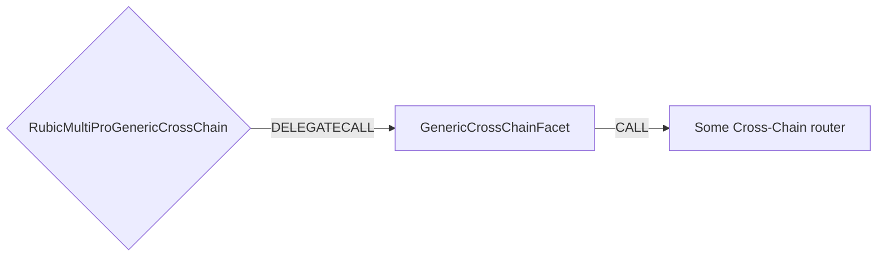

# GenericCrossChain Facet

## How it works

The GenericCrossChain Facet works by forwarding arbitrary calldata (obtained off-chain) to any whitelisted cross-chain router.
Swaps are supported since the Facet can patch the amount of tokens inside the calldata. Offset of the amount position inside the calldata is stored
for specific function of the specific router.



## Public Methods

- `function startBridgeTokensViaGenericCrossChain(IRubic.BridgeData memory _bridgeData, GenericCrossChainData calldata _genericData)`
  - Simply bridges tokens using GenericCrossChain
- `function swapAndStartBridgeTokensViaGenericCrossChain(
        IRubic.BridgeData memory _bridgeData,
        LibSwap.SwapData[] calldata _swapData,
        GenericCrossChainData calldata _genericData
    )`
  - Performs swap(s) before bridging tokens using GenericCrossChain

## GenericCrossChain Specific Parameters

The specific to GenericCrossChain Facet and is represented as the following struct type:

```solidity
/// @param router Address of the router that has to be called
/// @param approveTo Address of the gateway to approve to
/// @param extraNative Amount of native to send to a router
/// @param callData Calldata that has to be passed to the router
struct GenericCrossChainData {
    address router;
    address approveTo;
    uint256 extraNative;
    bytes callData;
}

```
## Fees

There are **three** fees included in the GenericCrossChain interaction:
1) [fixed native fee](./LibFees.md)
2) [token fee](./LibFees.md)

- **Fixed native fee** is subtracted from message value whether there is swap or not.
- **Token fee** is subtracted from the token transferred from user whether there is swap or not.

## Swap Data

Some methods accept a `SwapData _swapData` parameter.

Swapping is performed by a swap specific library that expects an array of calldata to can be run on variaous DEXs (i.e. Uniswap) to make one or multiple swaps before performing another action.

The swap library can be found [here](../src/Libraries/LibSwap.sol).

## Rubic Data

Some methods accept a `BridgeData _bridgeData` parameter.

This parameter is strictly for analytics purposes. It's used to emit events that we can later track and index in our subgraphs and provide data on how our contracts are being used. `BridgeData` and the events we can emit can be found [here](../src/Interfaces/IRubic.sol).
