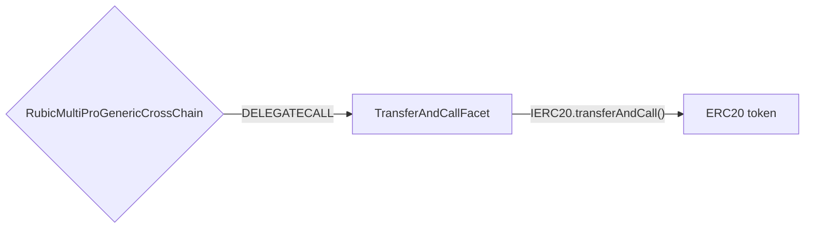

# TransferAndCall Facet

## How it works

The TransferAndCall Facet works by calling ```transferAndCall``` function on a token. Firstly the tokens are transferred on the Diamond Proxy and then after fees subtraction they are transferred to the address.



## Public Methods

- `function startBridgeTokensViaTransferAndCall(IRubic.BridgeData memory _bridgeData, TransferAndCallData calldata _transferAndCallData)`
  - Simply bridges tokens using transferAndCall method
- `function swapAndStartBridgeTokensViaTransferAndCall(
        IRubic.BridgeData memory _bridgeData,
        LibSwap.SwapData[] calldata _swapData,
        TransferAndCallData calldata _transferAndCallData
    )`
  - Performs swap(s) before bridging tokens using transferAndCall method

## TransferAndCall Facet Specific Parameters

The specific to TransferAndCall Facet and is represented as the following struct type:

```solidity
/// @param receiver Address where to send tokens and which to call
/// @param data Data to call the receiver with
struct TransferAndCallData {
    address receiver;
    bytes data;
}

```
## Fees

There are **three** fees included in the transfer proccess:
1) [fixed native fee](./LibFees.md)
2) [token fee](./LibFees.md)

- **Fixed native fee** is subtracted from message value whether there is swap or not.
- **Token fee** is subtracted from the token transferred from user whether there is swap or not.

## Swap Data

Some methods accept a `SwapData _swapData` parameter.

Swapping is performed by a swap specific library that expects an array of calldata to can be run on variaous DEXs (i.e. Uniswap) to make one or multiple swaps before performing another action.

The swap library can be found [here](../src/Libraries/LibSwap.sol).

## Rubic Data

Some methods accept a `BridgeData _bridgeData` parameter.

This parameter is strictly for analytics purposes. It's used to emit events that we can later track and index in our subgraphs and provide data on how our contracts are being used. `BridgeData` and the events we can emit can be found [here](../src/Interfaces/IRubic.sol).
