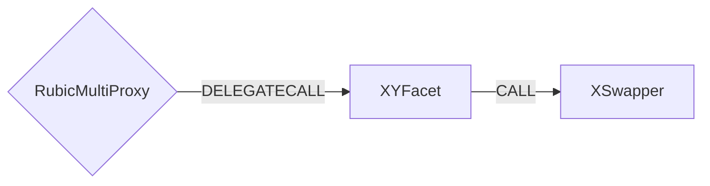

# XY Facet

## How it works

The XY Facet works by forwarding XY specific calls to a [XSwapper](https://docs.xy.finance/products/x-swap/swapper).



## Public Methods

- `function startBridgeTokensViaXY(IRubic.BridgeData memory _bridgeData, XYData calldata _xyData)`
  - Simply bridges tokens using XY
- `function swapAndStartBridgeTokensViaXY(
        IRubic.BridgeData memory _bridgeData,
        LibSwap.SwapData[] calldata _swapData,
        XYData calldata _xyData
    )`
  - Performs swap(s) before bridging tokens using XY

## XY Specific Parameters

The specific to XY Facet and is represented as the following struct type:

```solidity
/// @param toChainToken Fee paid to the transaction executor.
/// @param expectedToChainTokenAmount Represents the desired token on the target chain.
/// @param slippage Will be used to calculate the minimum received amount from expectedToChainTokenAmount
struct XYData {
    address toChainToken;
    uint256 expectedToChainTokenAmount;
    uint32 slippage;
}

```
## Fees

There are **three** fees included in the XY interaction:
1) [fixed native fee](./LibFees.md)
2) [token fee](./LibFees.md)

- **Fixed native fee** is subtracted from message value whether there is swap or not.
- **Token fee** is subtracted from the token transferred from user whether there is swap or not.

## Swap Data

Some methods accept a `SwapData _swapData` parameter.

Swapping is performed by a swap specific library that expects an array of calldata to can be run on variaous DEXs (i.e. Uniswap) to make one or multiple swaps before performing another action.

The swap library can be found [here](../src/Libraries/LibSwap.sol).

## Rubic Data

Some methods accept a `BridgeData _bridgeData` parameter.

This parameter is strictly for analytics purposes. It's used to emit events that we can later track and index in our subgraphs and provide data on how our contracts are being used. `BridgeData` and the events we can emit can be found [here](../src/Interfaces/IRubic.sol).
